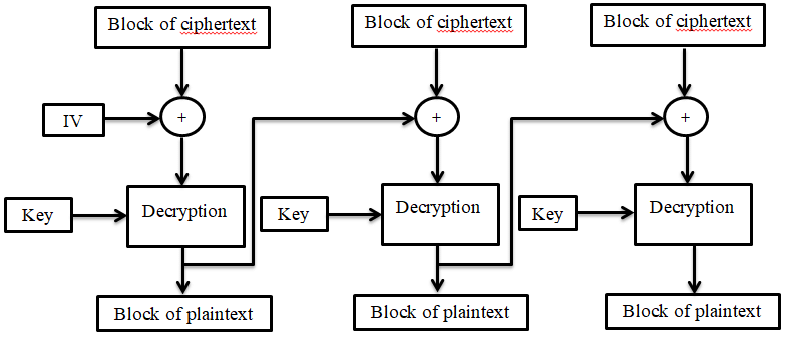

# AC - Lab03 Resolution

## Ex01

Solved on the file Ex01.py.

---

## Ex02

### Encryping using openSSL

**Command used**

```bash
openssl enc -e -aes-256-cbc -in plainText.txt -out enc.bin
```

**Note:** Asked for password. To keep it simple used password `1234`

### Decryping using openSSL

**Command used**

```bash
openssl enc -d -aes-256-cbc -in enc.bin
```

**Output observed**

```
enter AES-256-CBC decryption password:
*** WARNING : deprecated key derivation used.
Using -iter or -pbkdf2 would be better.
This is line number 1 of the cryptography lab.
This is line number 2 of the cryptography lab.
This is line number 3 of the cryptography lab.
This is line number 4 of the cryptography lab.
This is line number 5 of the cryptography lab.
This is line number 6 of the cryptography lab.
This is line number 7 of the cryptography lab.
This is line number 8 of the cryptography lab.
This is line number 9 of the cryptography lab.
This is line number 10 of the cryptography lab.
This is line number 11 of the cryptography lab.
This is line number 12 of the cryptography lab.
This is line number 13 of the cryptography lab.
This is line number 14 of the cryptography lab.
This is line number 15 of the cryptography lab.
This is line number 16 of the cryptography lab.
This is line number 17 of the cryptography lab.
This is line number 18 of the cryptography lab.
This is line number 19 of the cryptography lab.
This is line number 20 of the cryptography lab.
This is line number 21 of the cryptography lab...
```

The exact same text that was encrypted. That means the process was a success.

---

## Ex03

Lets use the file created by the openssl command on exercise 2: `enc.bin` \
To edit a single byte, it is easier to first change the data format from a stream of bytes to a stream of hexadecimal values using the tool `xxd`. Then we can decrypt the file using openssl and the password `1234`\
The workflow looks like this:

```bash
xxd enc.bin > enc.hex
# Change one byte from enc.hex
xxd -r enc.hex > enc_modified.bin
openssl enc -d -aes-256-cbc -in enc_modified.bin -out plainText_modified.txt
```

---

### Ex03.1 What happened? How much of the file was corrupted by this change in the ciphertext? 

Lets see the decrypted output of the modified encription:

**Command**

```bash
cat plainText_modified.txt
```

**Output observed**

```
This is line number 1 of the cryptography lab.
This is line number 2 of the cryptography lab.
This is line number 3 of the cryptography lab.
This is line number 4 of the cryptography lab.
This is line number 5 of the cryptography lab.
This is line number 6 of the cryptography lab.
This is line number 7 of the cryptography lab.
This is line number 8 of the cryptography lab.
This is line number 9 of the cryptography lab.
This is line number 10 of the cryptography lab.
This is line number 11 of the cryptograph��I�>�������7	�ine 1�mber 12 of the cryptography lab.
This is line number 13 of the cryptography lab.
This is line number 14 of the cryptography lab.
This is line number 15 of the cryptography lab.
This is line number 16 of the cryptography lab.
This is line number 17 of the cryptography lab.
This is line number 18 of the cryptography lab.
This is line number 19 of the cryptography lab.
This is line number 20 of the cryptography lab.
This is line number 21 of the cryptography lab...
```

**Conclusion**

Changing a single byte only changed a bit of the text on the area the byte was changed. The overall text is still readable. This happens because of the way CBC works.



As we can see, the fact that a cipher block as been changed, only means that the decryption of that block will be corrupted and also the decryption of the next block, since it does XOR with the previous decryption, which is corrupted. Everything beyond or before that stays the same.

**Note:** That does not mean the algorithm has bad diffusion, instead it means that the mode used (CBC) is secure against **error propagation**.

---

### Ex03.2 Could you recover a file encrypted with CBC if the IV and the first ciphertext block were corrupted (i.e. changed to other values)?

No, because the IV